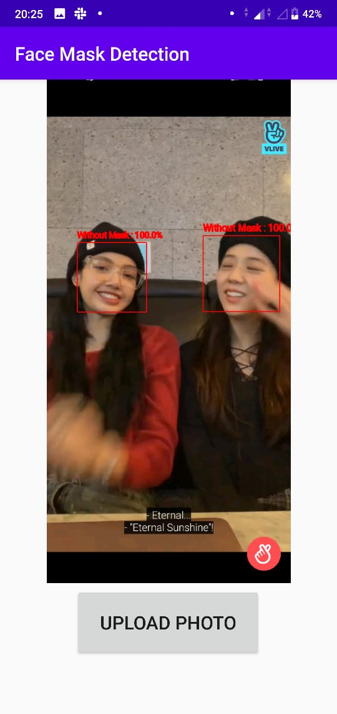

<h1 align="center">Face Mask Detection on Android</h1>
---

You can download face_mask_detector.apk here `APPS/face_mask_detector.apk`.

This project is a continuation of my previous project [face-mask-detection](https://github.com/Cindyalifia/face-mask-detection) and practicing about [TensorFlow Lite](https://www.tensorflow.org/lite) on Android to detect whether people wearing mask or not. 


<div align="center">
  
</div>


## Dependencies
---
---

- Python 3.6
- TensorFlow 2.1
- Android Studio

## How to Build 
---
---

### 1. Provide tflite model and label of the class
---

You can run all the code or you can download it in [train face mask prediction](https://github.com/Cindyalifia/face-mask-detection/blob/master/IPYNB_FILE/Training_Face_Mask_Prediction.ipynb). As I said that it is a continuation project, so you just need to take the model on my previous repository. 

You must provide `model.tflite` and `label.txt` first to continue predicting on Android. Here you can download these prerequisite file [model.tflite and label.txt](https://github.com/Cindyalifia/face-mask-detection/tree/master/ANDROID_DEPLOYEMENT).

### 2. Build Android app
---
After you are downloading those two prerequisite, you need to do these steps:

- Create a [new project](https://developer.android.com/training/basics/firstapp/creating-project) on Android Studio
- Copy `model.tflite` and `label.txt` and create a new folder called assets here `/android/app/src/main/assets` get both of them inside assets's folder
- You need to download these following library by typing it into `/android/build.gradle(:app)` folder. And don't forget to `Sync up`.
```kotlin
    implementation 'org.tensorflow:tensorflow-lite:0.0.0-nightly'
    implementation 'org.tensorflow:tensorflow-lite-gpu:0.0.0-nightly'
    implementation 'org.tensorflow:tensorflow-lite-support:0.0.0-nightly'
    implementation 'com.github.esafirm.android-image-picker:imagepicker:2.3.1'
    implementation 'com.github.bumptech.glide:glide:4.5.0'

    implementation 'com.google.android.gms:play-services-vision:20.0.0'

    api 'com.otaliastudios:cameraview:2.6.2'
```

- Follow the code in this file `/android/app/res/layout/activity_main.xml` (this contain the UI on the Device)
- Follow the code in file `/android/app/java/com.example.android/MainActivity.kt` this is the main code.

### 3. Build and run the app. 
--- 

The [Classifer](https://github.com/Cindyalifia/face-mask-detection/blob/master/Predicting_Face_Mask.py) reads the `model.tflite` from `assets` directory and loads it into an `Interpreter` for inference. The Interpreter provides an interface between TensorFlow Lite model and code, which is included in the following library.

If you are building your own apps, remember to add the following code to [build.gradle](https://github.com/nex3z/tflite-mnist-android/blob/master/android/app/build.gradle#L19) to prevent compression for model files.

```
aaptOptions {
    noCompress "tflite"
}
```

## Face Mask Detection Upload an Image on the Device
---
---

<div align="center">
  
</div>

Same kind with `live face mask detector`, this second apps is kindly have a similar concept. The differencess is in the two folders :
- `/android/app/res/layout/activity_main.xml` This file contain the UI on the Device. By changing this code you can upload an image from your internal memory.
- `/android/app/java/com.example.android/MainActivity.kt` and of course we need to change this since this is the main code.